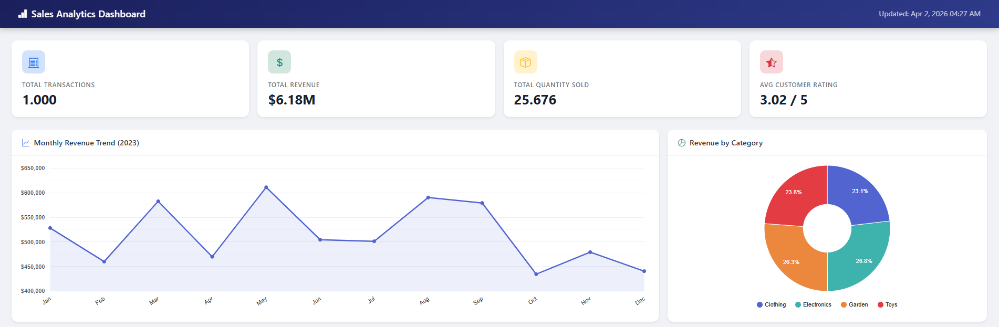
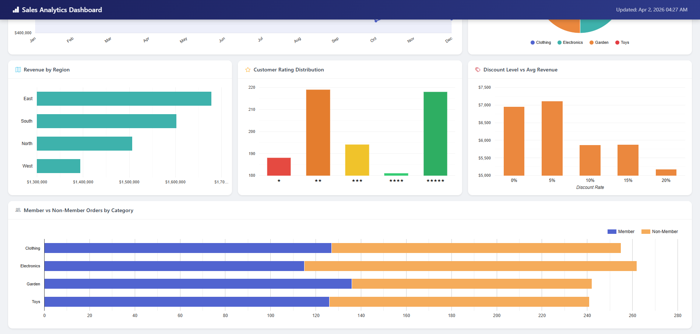

# Dashboard Analytics

## Prompt

```text
Hãy đóng vai chuyên gia xây dựng dashboard bằng Google Apps Script.
1. Nhiệm vụ của bạn
* Phân tích bộ dữ liệu và đề xuất các loại biểu đồ phù hợp.
* Xây dựng một dashboard tương tác hoàn chỉnh dưới dạng Google Apps Script Web
* App, sử dụng: Google Charts, Bootstrap

2. Yêu cầu kỹ thuật
* Tách code thành các file riêng: Code.gs, Index.html, JavaScript.html, CSS.html
* Chuẩn hóa toàn bộ dữ liệu ở phía server (bao gồm: ngày tháng, số, boolean).
* Đảm bảo các biểu đồ load chính xác và không xảy ra lỗi silent error.

3. Kết quả đầu ra cần có
* Giải thích ngắn gọn về các biểu đồ được sử dụng.
* Cung cấp toàn bộ code hoàn chỉnh có thể chạy được ngay.
* Hướng dẫn các bước triển khai đơn giản để một người không chuyên kỹ thuật vẫn có thể deploy được.
```

## Result




